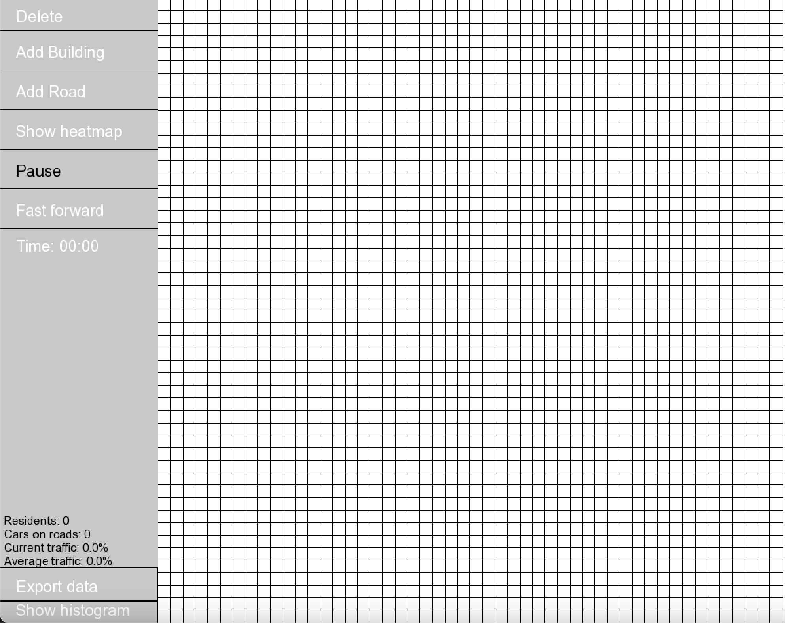

 Traffic simulator

## Disclamer: This project was a group project
The project was a part of Aalto University course ELEC-A7151, Object oriented programming with C++, organized by Yusein Ali, and the project advisor was Niilo Heinonen.

The project was developed by:
- Henrik Purokoski
- Otto Salmela
- Valtteri Silde (me)
- Jonna Takaneva

My responsibilities in this project:
- Implementing classes City, Square and Road
- Simulation of traffic inside and between roads and intersections.

## Overview
This program is used for simulating traffic in a city. The main interface of the simulator is the GUI, from which you can access all the features and analysis tools there is. The GUI provides an intuitive way to build, simulate and analyse the city. 

#### Roads and intersections
The city consists of basic building blocks, buildings and roads. The roads are then still separated into two categories, straight roads, and intersections. The roads have certain ammount space in them for cars. There is also different speed limits and intersection types (equal or traffic lights) available. The cars follow basic traffic rules with giving way to other cars.

#### Residents and cars
Every resident has its own unique daily schedule, which varies slightly from day to day. They have their own preferences about their favorite shops and it can change based on the data the residents recieve. The residents can travel within a car, or by walking. Each car has a starting point, and destination, which are determined by the passenger traveling in the vehicle.

#### Buildings
The buildings serve as the starting and ending points of the journeys made by cars. There are
three main types of buildings: Residential, Industrial and Commercial. Each building have
different stats, for example residential buildings have the number of residents, and Industrial
buildings have the number of workers.

#### Analysis
You can turn on the heatmap function for the roads, which shows the real time traffic situation with an accuracy of one lane on a road. Any square on the city can also be clicked on, to get more in depth statistics. Roads and interesections also have an additional histogram feature, that shows what the traffic has been historically. You can also export the stats to a .csv file.

## Installation

### Steps

#### Using vscode
The repository also includes files for building with vscode. To do this, follow these steps:
1. Open the project folder with vscode
2. From top bar go ```Terminal``` -> ```Run task```
3. Click ```Build project using cmake```
4. navigate to folder ```build/```
5. There should now be a executable, run it with the command ```./traffic```

#### Using cmake
The project can be built with cmake, using the ```CMakeLists.txt``` file provided.

### Requirements
The program requires cmake and c++17 or newer to be installed.

#### WSL users
If you are using Windows subsystem for linux the SFML library requires following libraries to be installed:
```
sudo apt install \
    libxrandr-dev \
    libxcursor-dev \
    libudev-dev \
    libopenal-dev \
    libflac-dev \
    libvorbis-dev \
    libgl1-mesa-dev \
    libegl1-mesa-dev \
    libdrm-dev \
    libgbm-dev
```
The SFML itself is already installed inside the git repository.

## **How to use the GUI**

### **Overview and modifying the city**
When you run the program, a window looking like this should open:

It is not recommended to resize this window, since it distorts the squares on the right side. On the left side, you can see a menu with various tools to modify the city, which is represented as a 50x50 grid on the right. You can select a tool by pressing on it, which turns the associated text black indicating it is in use. Under these tools you can see the current time of day of the simulation. Here is a brief overview of all the different tools:
- When "Delete" is selected and you press a square on the grid, it turns that square into an empty square
- Pressing "Add building" opens a dropdown menu from which you can select the type of building you want to add. After selecting the type of building you can add a building by clicking on squares on the grid
- "Add road" works just like "Add building", but **intersections don't need to be manually changed!** The program automatically turns roads with 3 or 4 "Road" neighbours into intersections without traffic lights
- "Show heatmap" splits roads into two lanes which are a color from green to red based on the amount of cars on them
- "Pause" indicates that the simulation is paused. **You cannot modify the city while the simulation is unpaused!** Unpausing updates the city accordingly (for example initializing residents) so to see changes, sometimes the simulation needs to be unpaused
- "Fast forward" indicates the speed of the simulation. When the text of the button is white, the simulation is on its lowest speed, when  it is black it is on medium speed and when it is red it is on maximum speed, which might be laggy on cities with a lot of residents

### **Analysis tools**
In the bottom left corner of the screen you can see different data associated with the city. There you can see the overall number of residents in the city, the number of cars currently on the roads, the current traffic percentage (how congested the roads are) and the average traffic percentage (how congested the roads have been throughout the entire simulation). Under these you can see two buttons. The first button, "Export data", exports the all the roads and intersections and their associated data into a csv file called "TrafficData.csv" which can be found in the build folder. The button under that, "Show histogram", opens a new window which has the hourly average traffic percentages from the entire city's roads.

To analyse a specific road (or get info from buildings), you can press on a specific square with no tool selected, which will open an info pop up. For roads and intersections there will be a "Show histogram" button on the top right corner of that pop up and pressing it will open a new window with the associated data displayed as a histogram.

### **Importing/exporting cities and changing resident count**
To export the current city that you have built, you can press "e" on the keyboard and to import a city you have previously exported, you can press "i". When trying to import/export, a message will be printed to the standard output stream based on if importing/exporting was successful or unsuccessful. Importing also supports different size cities, which can be modified from the start of the main function in main.cpp. Importing/exporting saves the associated square data such as road type, intersection type and residential building resident count, but doesn't save analysis data. The city is written (and read from) into the build folder into a file called "City.csv".

The resident count of a residential building is 100 by default. To change this, you can press "a" on the keyboard after which an input box pops up in the top left corner. Now you can type a number and press enter, which changes the resident count to that number. **The maximum of this is selected to be 5000**, which is entirely arbitrary and can be changed in GUI.cpp on line 700, but a realistic maximum threshold should still be given since buildings with extremely large amounts of residents could cause lag and/or crashing.


